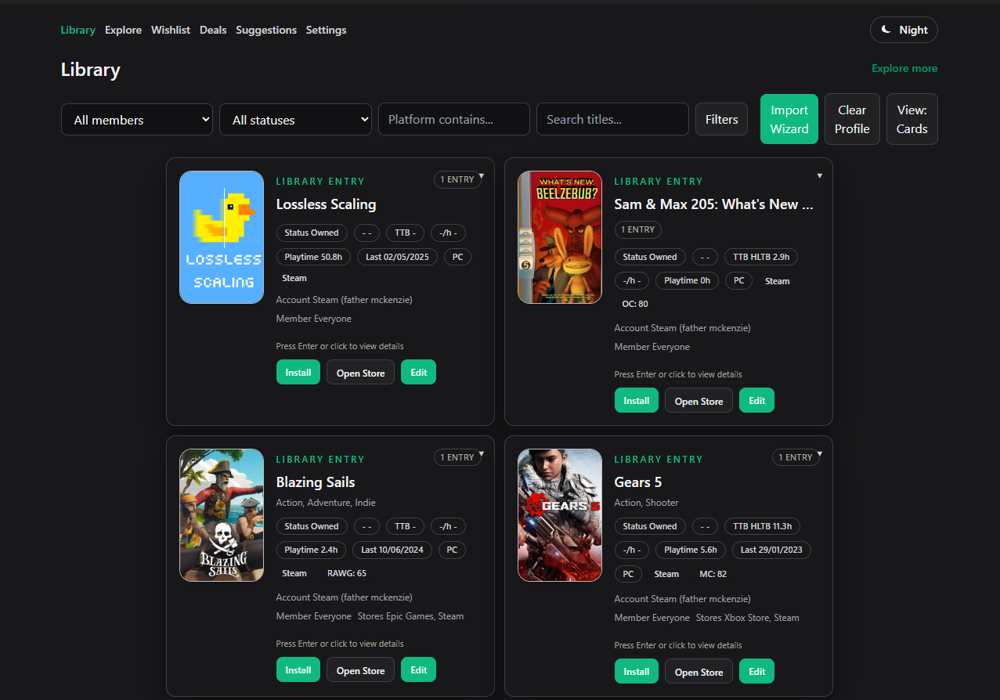
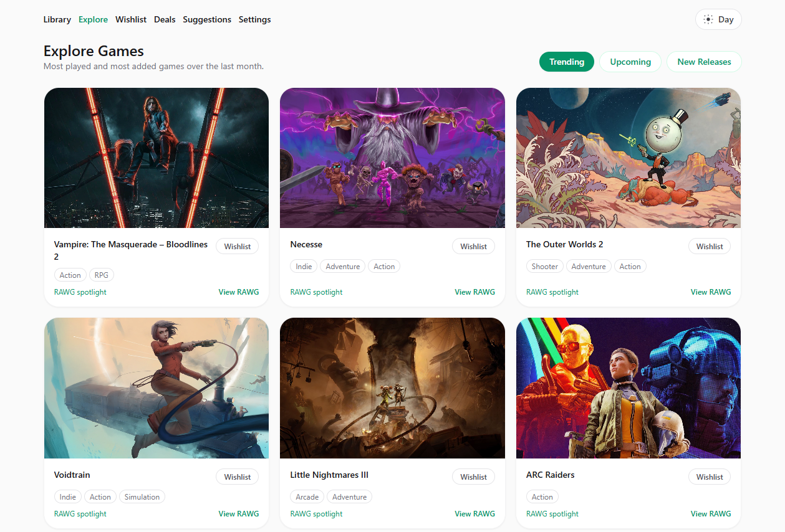
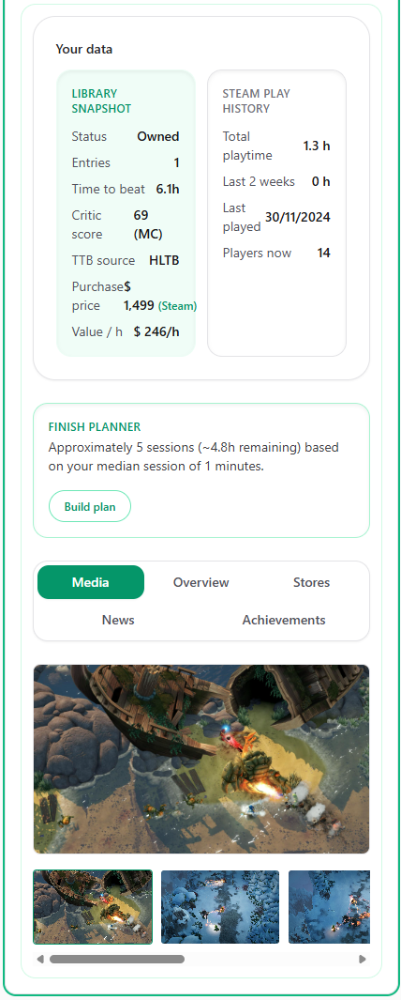

  

# Game Tracker

Open-source desktop + web app to track your PC game library, enrich metadata, plan play sessions, and spot great deals.

**Latest Release (Windows / macOS / Linux)**
- https://github.com/nclalperen/game-tracker/releases/latest
- Windows MSI is unsigned (open-source). SmartScreen: “More info” ? “Run anyway”.

**Monorepo Layout**
- `apps/web` — React + Vite + Dexie (IndexedDB)
- `apps/desktop` — Tauri v2 (Rust) shell for Windows/macOS/Linux
- `packages/core` — Shared logic (CSV, normalizers, scoring, types)
- `docs` — Release, QA, and dev docs

**Features**
- Library import (Steam + CSV) and robust wishlist sync (clear private/sign-in errors)
- Enrichment with strict precedence:
  - Covers: Steam ? RAWG ? IGDB ? placeholder
  - Time-to-beat: HLTB vendor ? HLTB live ? RAWG avg
  - Scores: Metacritic vendor ? OpenCritic ? RAWG aggregated
- Inline card details (expand in place), keyboard accessible (Enter/Space)
- Deals page (owned titles hidden by default), AI suggestions, dark mode
- Windows session logger (now playing + session history)

**Quick Start**
- Requirements: Node 20+, pnpm 10+, Git LFS; Rust (for desktop builds)
- Install: `pnpm -w install`
- Dev (web): `pnpm -C apps/web dev`
- Dev (desktop): `pnpm -C apps/desktop tauri dev`
- Build (web): `pnpm -C apps/web build`
- Bundle (desktop): `pnpm desktop:bundle`

**Environment & Settings**
- RAWG media: create `apps/web/.env.local` with `VITE_RAWG_KEY=...` (see `.env.example` files)
- Steam region/language and vendor toggles are configurable in Settings
- Large model files are tracked via Git LFS (see `docs/RELEASE.md`)

**Tests**
- Unit: `pnpm -w test`
- E2E (local):
  - `pnpm -C apps/web exec playwright install --with-deps`
  - `pnpm -C apps/web test:e2e`

**Releases**
- Tag `vX.Y.Z` to build cross-platform bundles in CI
- Notes: `docs/RELEASE_NOTES_*.md` (e.g., 0.1.0, 0.1.1)
- Checklist & signing guidance: `docs/RELEASE.md`, `docs/CODE_SIGNING.md`

**Open-Source Assets & Third-Party**
- Libraries: React, Vite, Dexie, Tauri, TailwindCSS, Playwright, DOMPurify, TanStack Virtual
- APIs / Datasets:
  - RAWG API (covers/media; https://rawg.io/apidocs)
  - HowLongToBeat (TTB; local dataset + optional live lookup)
  - Metacritic (vendor index compiled from CSV; personal use)
  - Steam Web API (prices/news), OpenCritic (scores via desktop bridge)
- Local LLM models (optional, via Git LFS): Llama-3.2-1B-Instruct, bge-base-en-v1.5. Use under their respective upstream licenses.
- Each upstream project is governed by its own license and terms — review before distribution or commercial use.

**Privacy & Terms**
- This app is for personal library management. Respect third-party terms for RAWG/HLTB/Metacritic/Steam/OpenCritic.
- Do not commit private API keys. Use `.env.local` for local development.

**Contributing & License**
- PRs and issues welcome. Please keep changes focused and documented.
- License: MIT

**Roadmap**
- See docs/ROADMAP.md for near / mid / long-term plans.

**Screenshots**
- Library
  
  
- Explore
  
  
- Inline Details
  
  

**Architecture**
- See `docs/ARCHITECTURE.md` for a system diagram and data flow.
